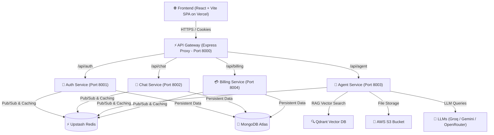

<div align="center">

  # 🤖 CortexAIAgent - Multi-Agent Autonomous AI System

  <p align="center">
    <b>A Production-Grade Microservices Architecture powering Multimodal AI Agents</b>
  </p>

  [](https://multi-a-gent-system.vercel.app/)
  [](https://multiagent-gateway.onrender.com)
  [](https://react.dev/)
  [](https://nodejs.org/)
  [](https://upstash.com/)
  [](LICENSE)

</div>

---

## 🌟 Overview

**CortexAIAgent** is an advanced, enterprise-ready Multi-Agent Autonomous AI platform built on a scalable **Event-Driven Microservices Architecture**. It decouples frontend operations from heavy AI workflows, leveraging LangChain, Qdrant Vector Search, and state-of-the-art LLMs (Groq, Google Gemini, OpenRouter) to deliver real-time multimodal intelligence.

## 🚀 Live Production Endpoints

| Service / Component | Hosting Platform | Deployed Live URL | Status |
| --- | --- | --- | --- |
| **Frontend Web App** | Vercel | [https://multi-a-gent-system.vercel.app/](https://multi-a-gent-system.vercel.app/) | `Live` 🟢 |
| **API Gateway** | Render | [https://multiagent-gateway.onrender.com](https://multiagent-gateway.onrender.com) | `Live` 🟢 |
| **Auth Microservice** | Render | `https://multiagent-auth.onrender.com` | `Live` 🟢 |
| **Chat Microservice** | Render | `https://multiagent-chat.onrender.com` | `Live` 🟢 |
| **AI Agent Microservice** | Render | `https://multiagent-agent.onrender.com` | `Live` 🟢 |
| **Billing Microservice** | Render | `https://multiagent-billing.onrender.com` | `Live` 🟢 |
| **Cloud Redis Database** | Upstash | `rediss://cool-piranha-73914.upstash.io` | `Live` 🟢 |

---

## 🔥 Key Features & AI Agents

### 🧠 Specialized Autonomous Agents
1. **👁️ Vision Agent:** Analyzes image inputs, detects objects, and performs optical reasoning using vision LLMs.
2. **📄 PDF RAG Agent:** Implements Retrieval-Augmented Generation over uploaded PDF documents via **Qdrant Vector Database**.
3. **🌐 Web Search Agent:** Real-time web search and live internet grounding using Tavily AI API.
4. **📊 PPT Generator Agent:** Automatically crafts structured presentation decks based on user prompts.
5. **💻 Coding Assistant:** Writes, refactors, and debugs code across multiple programming languages.

### ⚙️ System Capabilities
- **Decoupled Microservices:** API Gateway routing requests to 4 independent backend microservices.
- **Low-Latency Session Caching:** Powered by **Upstash Redis** for fast multi-turn conversation memory recovery.
- **Fail-Safe Auth & Payments:** Firebase Authentication + Razorpay Payment Gateway integration with dynamic user credit deduction.
- **Full Containerization:** Dockerized services with single-command `docker compose` deployment.

---

## 🏗 System Architecture



---

## 🛠 Tech Stack

| Domain | Technologies |
| --- | --- |
| **Frontend** | React 19, Vite, Redux Toolkit, TailwindCSS, Monaco Editor, Motion, Lucide Icons |
| **Backend & Microservices** | Node.js, Express.js, Express HTTP Proxy, Morgan, Cookie-Parser |
| **Databases & Cache** | MongoDB Atlas, Qdrant Cloud Vector DB, Upstash Redis |
| **AI Framework & APIs** | LangGraph, LangChain, Groq API, Google Gemini AI, OpenRouter, Tavily Web Search |
| **Storage & Auth** | AWS S3 (SDK v3), Firebase Authentication, Razorpay Payments |
| **DevOps & Infrastructure** | Docker, Docker Compose, Nginx Reverse Proxy, Vercel, Render PaaS |

---

## 📁 Repository Structure

```text
MultiAgentSystem/
├── frontend/                # React 19 + Vite Web Application
│   ├── public/              # Icons, Favicons, Static Assets
│   ├── src/                 # Redux Slices, UI Components, Pages
│   └── utils/               # Axios Client Configuration
├── backend/                 # Microservices Core
│   ├── gateway/             # Central API Proxy Gateway (Port 8000)
│   ├── shared/              # Shared Redis & Database Utilities
│   └── services/            # Decoupled Services
│       ├── agent/           # LangChain AI Graph Agents (Vision, RAG, PPT, Search)
│       ├── auth/            # Firebase User Auth & Credits Manager
│       ├── chat/            # Conversation History & Message Store
│       └── billing/         # Razorpay Orders & Subscription Handling
├── docker-compose.yml       # Production Multi-Container Manifest
├── DEPLOYMENT.md            # Comprehensive Production Deployment Manual
└── README.md                # System Documentation
```

---

## 🚀 Quick Start (Local Development)

### Prerequisites
- [Node.js v18+](https://nodejs.org/)
- [Docker & Docker Compose](https://www.docker.com/)
- [MongoDB Atlas Account](https://www.mongodb.com/cloud/atlas)

### 1. Clone the Repository
```bash
git clone https://github.com/YOUR_GITHUB_USERNAME/MultiAgentSystem.git
cd MultiAgentSystem
```

### 2. Configure Environment Variables
Copy `.env.example` to `.env` in the root and fill in your keys:
```bash
cp .env.example .env
```

### 3. Run via Docker Compose (Recommended)
Launch all 5 microservices and Redis simultaneously:
```bash
docker compose up -d --build
```
Check running services:
```bash
docker compose ps
```

### 4. Run Frontend Locally
```bash
cd frontend
npm install
npm run dev
```
Open `http://localhost:5173` in your browser!

---

## 🔐 Environment Variables Reference

```env
# Server Config
FRONTEND_URL=https://multi-a-gent-system.vercel.app

# Database & Cache
MONGODB_URL=mongodb+srv://<username>:<password>@cluster.mongodb.net/agent
REDIS_URL=rediss://default:<password>@cluster.upstash.io:6379

# AI & LLM Keys
GROQ_API_KEY=gsk_...
GOOGLE_API_KEY=AQ....
OPENROUTER_API_KEY=sk-or-v1-...
TAVILY_API_KEY=tvly-...

# Vector DB & Storage
QDRANT_URL=https://<cluster-id>.qdrant.io
QDRANT_API_KEY=eyJhbGci...
AWS_REGION=ap-southeast-2
AWS_ACCESS_KEY_ID=AKIA...
AWS_SECRET_KEY=...
AWS_BUCKET_NAME=cortex-ai-agent

# Payments & Auth
FIREBASE_SERVICE_ACCOUNT={"type":"service_account",...}
RAZORPAY_KEY_ID=rzp_test_...
RAZORPAY_KEY_SECRET=...
```

---

## 🤝 Contributing

Contributions are welcome! Feel free to open an Issue or submit a Pull Request to enhance AI Agents, add vector index strategies, or optimize service pipelines.

---

<div align="center">
  Crafted with ❤️ by <b>Mayank Trivedi</b>
</div>
